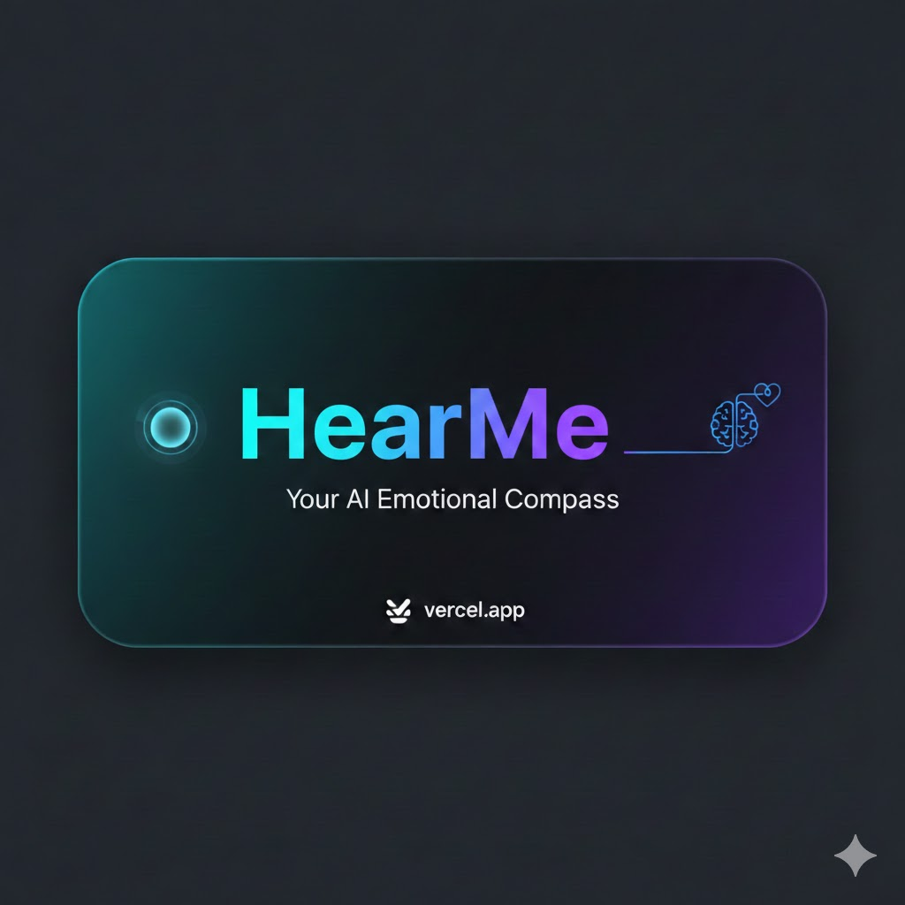

<p align="center"></p>

# HearMe 🎯
### Your AI-Powered Emotional Companion

---

## Basic Details
**Team Name:** HackHive

**Team Members:** 
- Avanthika.c - MAMO
- Shana Subair - MAMO

**Hosted Project Link:** https://hear-me-two.vercel.app/

## Project Description
HearMe is a modern web application designed to act as an interactive emotional companion. Unlike standard mood trackers, HearMe "listens" to the stories users tell, identifies the underlying emotional state using specialized sentiment logic, and responds with tailored empathetic support, psychological insights, and musical recommendations.

## The Problem & Solution
**The Problem:** In today's fast-paced world, many individuals experience "emotional loneliness" or burnout without an immediate, non-judgmental outlet to process their feelings. Traditional journaling can feel like a chore, and users often struggle to identify what exactly they need when they are overwhelmed.

**The Solution:** HearMe provides a safe, digital space for instant venting. It uses an advanced situational "Story Recognition" engine to validate specific life events (like work stress or relationship issues) while providing scientifically-backed tips and curated soundtracks to gently regulate the user's mood.

---

## Technical Details
**Technologies Used:**
- **Languages:** JavaScript (ES6+), HTML5, CSS3
- **Frameworks:** React.js, Vite
- **State Management:** React Hooks (useState, useEffect)
- **Deployment:** Vercel
- **Persistence:** LocalStorage API
- **Design:** Modern Glassmorphism & Vanilla CSS

---

## Features
1. **Story Recognition & Contextual Empathy:** Identifies specific situational themes such as Work/School, Relationships, Loss, and Success, providing grounded, contextual validation.
2. **Expanded Emotional Brain:** Detects 15+ distinct emotional states (e.g., Proud, Overwhelmed, Inspired, Anxious) with high-quality, supportive feedback.
3. **Weekly Mood Insights:** A persistence-based visual distribution of moods over the last 7 days, helping users identify emotional patterns and trends.
4. **Structured AI Responses:** Every analysis includes empathetic acknowledgment, practical "Why it works" psychological tips, and balanced song suggestions.
5. **Responsive Glassmorphic UI:** A premium pastel green aesthetic with subtle micro-animations and smooth transitions, fully optimized for mobile and desktop.

---

## Implementation
### Installation:
```bash
# Clone the repository
git clone https://github.com/your-repo-link/HearMe.git

# Navigate to the project directory
cd HearMe

# Install dependencies
npm install
```

### Run:
```bash
# Start the development server
npm run dev
```

---

## Project Documentation
### Screenshots:
![Main Interface: Clean input area with calming pastel theme]"C:\Users\LENOVO\Desktop\HearMe\maininterface.png"
*Main Interface: Clean input area with calming pastel theme.*

![Analysis Results: Structured feedback with situational context badge]"C:\Users\LENOVO\Desktop\HearMe\S2.png"
*Analysis Results: Structured feedback with situational context badge.*

![Weekly Insights: Visual distribution of emotional patterns]"C:\Users\LENOVO\Desktop\HearMe\s3.png"
*Weekly Insights: Visual distribution of emotional patterns.*

### Diagrams:
#### System Architecture:
The application follows a modular React architecture. The UI components communicate with a central `moodLogic` engine that performs keyword and synonym matching against situational (`STORY_DATA`) and emotional (`MOOD_DATA`) datasets. State is managed locally and persisted via the `LocalStorage API`.

#### Workflow:
1. **User Input:** User shares their story or mood in the text area.
2. **Analysis:** The system scans for situational keywords, then emotional keywords.
3. **Response Generation:** Logic merges detected context and emotion into a structured supportive response.
4. **Update UI:** Results fade in; Weekly Insights and History are updated instantly.

---

## Project Demo
### Video:
[Watch the HearMe Demo Link]([INSERT_DEMO_VIDEO_LINK])

---

## AI Tools Used
**Tool:** Antigravity (Cortex)
**Purpose:** HearMe was developed using Antigravity for UI generation, complex logic implementation (Story Recognition), and architectural refinements.
**Prompts:**
- "Create a modern pastel green UI with glassmorphism for a mood tracker."
- "Implement a logic that detects specific life stories like work stress or relationship issues and bridges them to emotional support."
- "Create a weekly insights section that visualizes mood distribution from localStorage."

---

## Team Contributions
- **Avanthika.c:** Core React Architecture, Mood Detection Logic, and UI Polish.
- **Shana Subair:** Feature Design, Weekly Insights Implementation, and Deployment.

---

## License
This project is licensed under the MIT License.

---
Made with ❤️ at TinkerHub
